# Telehealth System - Complete Architecture & Data Flow

## System Overview

The Telehealth System is a comprehensive FHIR-compliant healthcare platform with dual-mode operation, supporting both mock data development and live FHIR production environments. The system is deployed on Vercel with automatic CI/CD and can optionally connect to local Medplum FHIR servers for development.

## 🏗️ High-Level Architecture

```mermaid
graph TB
    %% User Interface Layer
    subgraph "🖥️ Frontend Layer"
        Browser[User Browser]
        ReactApp[React 19 Application]
        ModeSwitch[Mode Switcher Component]
    end
    
    %% Application Core
    subgraph "⚙️ Application Core"
        Router[React Router v7]
        ModeContext[Mode Context Provider]
        AuthStore[Zustand Auth Store]
        QueryClient[TanStack Query Client]
    end
    
    %% Dual Mode System
    subgraph "🔄 Dual Mode System"
        MockMode[Mock Data Mode]
        FHIRMode[Live FHIR Mode]
    end
    
    %% Data Sources
    subgraph "📊 Data Sources"
        MockData[Comprehensive Mock Data]
        MedplumAPI[Medplum FHIR Server]
        PostgresDB[(PostgreSQL Database)]
        RedisCache[(Redis Cache)]
    end
    
    %% Infrastructure
    subgraph "🚀 Deployment Infrastructure"
        VercelApp[Vercel Deployment]
        LocalMedplum[Local Medplum Server]
        DockerCompose[Docker Compose - Optional]
        NginxProxy[Nginx Reverse Proxy]
    end
    
    %% Connections
    Browser --> ReactApp
    ReactApp --> Router
    ReactApp --> ModeSwitch
    ModeSwitch --> ModeContext
    Router --> AuthStore
    Router --> QueryClient
    
    ModeContext --> MockMode
    ModeContext --> FHIRMode
    
    MockMode --> MockData
    FHIRMode --> MedplumAPI
    
    MedplumAPI --> LocalMedplum
    LocalMedplum --> PostgresDB
    LocalMedplum --> RedisCache
    
    Browser --> VercelApp
    ReactApp --> VercelApp
    
    DockerCompose --> LocalMedplum
    DockerCompose --> PostgresDB
    DockerCompose --> RedisCache
    DockerCompose --> NginxProxy
```



## 🔄 Dual-Mode Architecture

### Mode Switching Flow

```mermaid
graph LR
    subgraph "🎛️ Mode Control"
        NavBar[Navigation Bar]
        ModeSwitcher[Mode Switcher Toggle]
        ModeContext[Mode Context]
    end
    
    subgraph "📊 Mock Data Mode"
        MockHooks[Mock Data Hooks]
        MockPatients[Mock Patient Data]
        MockAppointments[Mock Appointments]
        MockOrders[Mock Orders]
        MockMetrics[Mock Dashboard Metrics]
    end
    
    subgraph "🏥 Live FHIR Mode"
        MedplumHooks[Medplum FHIR Hooks]
        FHIRPatients[FHIR Patient Resources]
        FHIRAppointments[FHIR Appointment Resources]
        FHIROrders[FHIR ServiceRequest Resources]
        FHIRMetrics[Live Dashboard Metrics]
    end
    
    NavBar --> ModeSwitcher
    ModeSwitcher --> ModeContext
    
    ModeContext -->|Mock Mode| MockHooks
    ModeContext -->|FHIR Mode| MedplumHooks
    
    MockHooks --> MockPatients
    MockHooks --> MockAppointments
    MockHooks --> MockOrders
    MockHooks --> MockMetrics
    
    MedplumHooks --> FHIRPatients
    MedplumHooks --> FHIRAppointments
    MedplumHooks --> FHIROrders
    MedplumHooks --> FHIRMetrics
```



## 📱 Application Routes & Pages

```mermaid
graph TB
    %% Main Application Entry
    App[App.tsx] --> Router{React Router v7}
    
    %% Authentication Routes
    Router --> Login[/login - LoginPage]
    Router --> Unauthorized[/unauthorized - UnauthorizedPage]
    
    %% Protected Routes Container
    Router --> Protected[Protected Routes - AppLayout]
    
    %% Core Healthcare Pages (Dual Mode)
    Protected --> Dashboard[/ or /dashboard]
    Protected --> Patients[/patients]
    Protected --> Sessions[/sessions]
    Protected --> Orders[/orders]
    Protected --> Tasks[/tasks]
    Protected --> Messages[/messages]
    
    %% Administrative Pages (Dual Mode)
    Protected --> Invoices[/invoices]
    Protected --> Insurance[/insurance]
    Protected --> Providers[/providers]
    Protected --> Pharmacies[/pharmacies]
    Protected --> Products[/products]
    Protected --> Resources[/resources]
    
    %% System Management Pages (Dual Mode)
    Protected --> Forms[/forms]
    Protected --> Settings[/settings]
    Protected --> Tags[/tags]
    Protected --> Audit[/audit]
    Protected --> Discounts[/discounts]
    
    %% Page Implementations
    subgraph "📄 Page Implementations"
        MockPages[Mock Data Pages<br/>- Dashboard/<br/>- Patients/<br/>- Sessions/<br/>- etc.]
        MedplumPages[Medplum FHIR Pages<br/>- Dashboard-Medplum/<br/>- Patients-Medplum/<br/>- Sessions-Medplum/<br/>- etc.]
    end
    
    Dashboard --> MockPages
    Dashboard --> MedplumPages
    Patients --> MockPages
    Patients --> MedplumPages
    Sessions --> MockPages
    Sessions --> MedplumPages
```

## 🎣 Data Hooks Architecture

### Mock Data Hooks (src/hooks/useQuery.ts)

```mermaid
graph TB
    subgraph "🎭 Mock Data Hooks"
        usePatients[usePatients<br/>- 8 comprehensive patient records<br/>- Search filtering<br/>- Demographics & medical history]
        
        useAppointments[useAppointments<br/>- 8 detailed appointments<br/>- Multiple types & statuses<br/>- Video/in-person sessions]
        
        useOrders[useOrders<br/>- Lab orders & prescriptions<br/>- Status tracking<br/>- Priority levels]
        
        useDashboardMetrics[useDashboardMetrics<br/>- Patient counts: 1,247<br/>- Today's appointments: 12<br/>- Revenue trends & growth]
        
        usePatient[usePatient<br/>- Single patient by ID<br/>- Complete medical record<br/>- Insurance & contacts]
    end
    
    subgraph "📊 Mock Data Store"
        PatientData[Patient Records<br/>- John Smith (Diabetes)<br/>- Sarah Johnson (Hypertension)<br/>- Michael Brown (Asthma)<br/>- Emily Davis (Anxiety)<br/>- David Wilson (Chronic Pain)<br/>- Lisa Anderson (Arthritis)<br/>- Robert Taylor (Heart Disease)<br/>- Jennifer Martinez (Depression)]
        
        AppointmentData[Appointment Records<br/>- Consultation sessions<br/>- Follow-up appointments<br/>- Mental health sessions<br/>- Chronic care management<br/>- Specialist consultations<br/>- Sports medicine<br/>- Pain management<br/>- Preventive care]
        
        OrderData[Order Records<br/>- Blood work orders<br/>- Prescription requests<br/>- Imaging studies<br/>- Lab test results<br/>- Medication refills]
        
        MetricsData[Dashboard Metrics<br/>- Real-time patient counts<br/>- Appointment statistics<br/>- Revenue tracking<br/>- Growth percentages<br/>- Weekly trends]
    end
    
    usePatients --> PatientData
    useAppointments --> AppointmentData
    useOrders --> OrderData
    useDashboardMetrics --> MetricsData
    usePatient --> PatientData
```

### Medplum FHIR Hooks (src/hooks/useMedplum.ts)

```mermaid
graph TB
    subgraph "🏥 Medplum FHIR Hooks"
        usePatientsMedplum[usePatientsMedplum<br/>- FHIR Patient resources<br/>- Real-time API calls<br/>- Search & filtering]
        
        useAppointmentsMedplum[useAppointmentsMedplum<br/>- FHIR Appointment resources<br/>- Status management<br/>- Provider scheduling]
        
        useOrdersMedplum[useOrdersMedplum<br/>- FHIR ServiceRequest resources<br/>- Clinical orders<br/>- Lab & prescription requests]
        
        useTasksMedplum[useTasksMedplum<br/>- FHIR Task resources<br/>- Workflow management<br/>- Assignment tracking]
        
        useMessagesMedplum[useMessagesMedplum<br/>- FHIR Communication resources<br/>- Secure messaging<br/>- Provider-patient communication]
    end
    
    subgraph "🔗 FHIR API Endpoints"
        PatientAPI[/fhir/R4/Patient<br/>- GET, POST, PUT, DELETE<br/>- Search parameters<br/>- Resource validation]
        
        AppointmentAPI[/fhir/R4/Appointment<br/>- Scheduling operations<br/>- Status updates<br/>- Provider assignments]
        
        ServiceRequestAPI[/fhir/R4/ServiceRequest<br/>- Clinical orders<br/>- Lab requests<br/>- Prescription orders]
        
        TaskAPI[/fhir/R4/Task<br/>- Workflow tasks<br/>- Assignment management<br/>- Status tracking]
        
        CommunicationAPI[/fhir/R4/Communication<br/>- Secure messaging<br/>- Message threads<br/>- Attachment support]
    end
    
    usePatientsMedplum --> PatientAPI
    useAppointmentsMedplum --> AppointmentAPI
    useOrdersMedplum --> ServiceRequestAPI
    useTasksMedplum --> TaskAPI
    useMessagesMedplum --> CommunicationAPI
```

## 🐳 Docker Architecture

### Development Environment (docker-compose.dev.yml)


### Production Environment (docker-compose.yml)

```mermaid
graph TB
    subgraph "🚀 Production Stack"
        ProdApp[Telehealth App<br/>Port: 3000<br/>Nginx Reverse Proxy<br/>Static Asset Serving]
        
        MedplumProd[Medplum Server<br/>Port: 8103<br/>Production Config<br/>SSL Ready]
        
        PostgresProd[PostgreSQL<br/>Port: 5432<br/>Persistent Storage<br/>Volume: postgres_data]
        
        RedisProd[Redis Cache<br/>Port: 6379<br/>Production Cache<br/>Volume: redis_data]
    end
    
    subgraph "🔒 Security Features"
        NginxConfig[Nginx Configuration<br/>- CORS Headers<br/>- Security Headers<br/>- Gzip Compression<br/>- Asset Caching]
        
        HealthChecks[Health Monitoring<br/>- Container Health<br/>- Service Availability<br/>- Automatic Restart]
    end
    
    ProdApp --> MedplumProd
    MedplumProd --> PostgresProd
    MedplumProd --> RedisProd
    
    ProdApp --> NginxConfig
    ProdApp --> HealthChecks
    MedplumProd --> HealthChecks
```



## 🔐 Authentication & Authorization

```mermaid
graph TB
    subgraph "🔑 Authentication Flow"
        LoginPage[Login Page]
        MedplumAuth[Medplum OAuth]
        AuthStore[Zustand Auth Store]
        TokenStorage[Token Storage]
    end
    
    subgraph "👥 Role-Based Access Control"
        SuperAdmin[Super Admin<br/>- Full system access<br/>- All CRUD operations<br/>- System configuration]
        
        HealthcareProvider[Healthcare Provider<br/>- Patient care<br/>- Clinical operations<br/>- Form builder access]
        
        PracticeManager[Practice Manager<br/>- Management operations<br/>- Reporting access<br/>- Form builder access]
        
        Receptionist[Receptionist<br/>- Appointment management<br/>- Limited patient access<br/>- Front office operations]
        
        BillingSpecialist[Billing Specialist<br/>- Billing operations<br/>- Insurance management<br/>- Financial reporting]
    end
    
    subgraph "🛡️ Permission System"
        PermissionCheck[permissions.ts<br/>- Role validation<br/>- Feature access control<br/>- Route protection]
        
        ProtectedRoutes[Protected Routes<br/>- Authentication required<br/>- Role-based rendering<br/>- Unauthorized handling]
    end
    
    LoginPage --> MedplumAuth
    MedplumAuth --> AuthStore
    AuthStore --> TokenStorage
    
    AuthStore --> SuperAdmin
    AuthStore --> HealthcareProvider
    AuthStore --> PracticeManager
    AuthStore --> Receptionist
    AuthStore --> BillingSpecialist
    
    SuperAdmin --> PermissionCheck
    HealthcareProvider --> PermissionCheck
    PracticeManager --> PermissionCheck
    Receptionist --> PermissionCheck
    BillingSpecialist --> PermissionCheck
    
    PermissionCheck --> ProtectedRoutes
```



## 📊 Data Flow Patterns

### Mock Data Flow


### Live FHIR Data Flow


## 🔄 Error Handling & Fallbacks

```mermaid
graph TB
    subgraph "⚠️ Error Scenarios"
        NetworkError[Network Connection Failed]
        ServerDown[Medplum Server Unavailable]
        AuthError[Authentication Failed]
        ValidationError[FHIR Validation Error]
    end
    
    subgraph "🛡️ Error Handling"
        ErrorBoundary[React Error Boundary]
        TryCatch[Try-Catch Blocks]
        ErrorHandler[Error Handler Utility]
        NotificationSystem[Mantine Notifications]
    end
    
    subgraph "🔄 Fallback Mechanisms"
        MockFallback[Automatic Mock Data Fallback]
        RetryLogic[Automatic Retry Logic]
        CacheFirst[Cache-First Strategy]
        GracefulDegradation[Graceful UI Degradation]
    end
    
    NetworkError --> ErrorHandler
    ServerDown --> ErrorHandler
    AuthError --> ErrorHandler
    ValidationError --> ErrorHandler
    
    ErrorHandler --> ErrorBoundary
    ErrorHandler --> TryCatch
    ErrorHandler --> NotificationSystem
    
    ErrorHandler --> MockFallback
    ErrorHandler --> RetryLogic
    ErrorHandler --> CacheFirst
    ErrorHandler --> GracefulDegradation
```



## 🚀 Deployment Architecture

### Multi-Stage Docker Build


## 📈 Performance & Monitoring


## 🔧 Development Workflow

```mermaid
graph LR
    subgraph "💻 Local Development"
        LocalDev[npm run dev<br/>Mock Data Mode<br/>Hot Reload<br/>TypeScript Checking]
    end
    
    subgraph "🐳 Docker Development"
        DockerDev[docker-compose -f docker-compose.dev.yml up<br/>Full Stack<br/>Live FHIR Mode<br/>Database Persistence]
    end
    
    subgraph "🚀 Production Build"
        ProdBuild[docker-compose up<br/>Production Stack<br/>Nginx Proxy<br/>Optimized Assets]
    end
    
    LocalDev --> DockerDev
    DockerDev --> ProdBuild
    
    LocalDev -.->|Mode Switch| DockerDev
    DockerDev -.->|Testing| ProdBuild
```



This comprehensive architecture supports both rapid development with mock data and production-ready FHIR compliance, providing healthcare organizations with a complete, scalable telehealth platform.